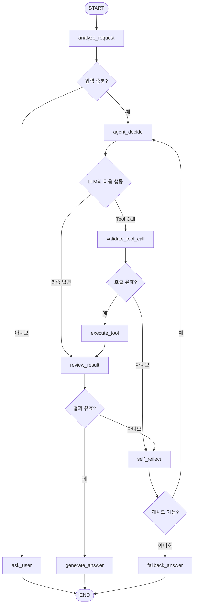

# 에이전트 아키텍처 설계서 샘플

> 이 문서는 `05_llm-agent-orchestration`에서 배운 내용을 일정 조정 프로젝트에 적용한 작성 예시입니다. 팀의 실제 코드, Node 이름, Tool Schema와 실행 결과에 맞게 수정한 뒤 제출합니다.

## 1. 프로젝트 개요

| 항목 | 내용 |
| --- | --- |
| 프로젝트명 | 복합 API 연계 일정 조정 AI Agent |
| 사용자 목표 | 여러 참석자의 일정을 조회해 가능한 회의 시간을 찾고 초대 메시지를 작성한다. |
| 판단 주체 | OpenAI LLM이 현재 State와 Tool Result를 보고 다음 Tool 또는 종료를 판단한다. |
| 실행 통제 | Python Backend가 Tool Allowlist, Schema, 분기, 재시도와 종료 조건을 통제한다. |
| Workflow 표현 | LangGraph `StateGraph` |
| 기본 데이터 | 외부 Calendar API 대신 결정적인 Mock 일정 데이터 |
| Agent 구성 | 하나의 목표를 처리하는 Single AI Agent |

## 2. 해결하려는 문제

회의 일정을 정하려면 참석자, 날짜 범위와 회의 시간이 필요합니다. 이 정보가 갖춰지면 참석자의 기존 일정을 조회하고 공통 가능 시간을 계산해야 합니다. 정보가 부족하거나 Tool이 실패했을 때 Agent가 답을 꾸며내지 않고 추가 질문, 재시도 또는 대체 제안을 선택해야 합니다.

예시 요청:

```text
“민수, 지영과 9월 8일부터 10일 사이에 30분 회의 가능한 시간을 찾아 줘.”
```

정상 흐름:

```text
사용자 요청
→ 요청을 구조화된 데이터로 분석
→ 참석자 일정 조회 Tool 선택
→ Tool 실행 결과를 State에 저장
→ 공통 가능 시간 계산 Tool 선택
→ 결과 검증
→ 초대 메시지 초안 작성
→ 최종 답변
```

## 3. Workflow와 AI Agent의 역할 구분

이 프로젝트는 모든 실행 순서를 LLM에 맡기지 않습니다.

| 구성 요소 | 담당 역할 |
| --- | --- |
| LangGraph Workflow | 실행 가능한 Node, 분기, 반복, 중단과 종료 경로를 정의한다. |
| LLM 기반 AI Agent | 목표, State와 Tool Result를 보고 필요한 다음 Tool 또는 최종 답변을 제안한다. |
| Tool | 일정 조회, 가능 시간 계산과 초대 메시지 초안 작성처럼 한 가지 기능을 실행한다. |
| Python Backend | Tool 입력 검증, 실제 호출, 결과 Routing, 재시도 한도와 정책을 보장한다. |
| Review Node | Tool 결과의 충분성, 일관성과 오류를 결정적인 규칙으로 검사한다. |

```text
LLM = 다음 행동을 제안
Python = 제안을 검증하고 Tool 실행
LangGraph = 전체 State 이동과 반복 경로를 관리
```

## 4. Single Agent를 선택한 이유

현재 프로젝트는 “공통 회의 시간 제안”이라는 하나의 사용자 목표를 가집니다. 모든 Tool이 일정 조정 도메인에 속하고 하나의 State로 실행을 설명할 수 있으므로 Single Agent가 적합합니다.

Multi-Agent로 나누지 않은 이유:

- 일정 분석, 조회와 제안이 하나의 짧은 작업 흐름으로 이어집니다.
- 역할마다 독립적인 지식이나 별도 권한이 필요하지 않습니다.
- Agent 수를 늘리면 Handoff, Context 전달과 실패 조합이 불필요하게 증가합니다.

향후 캘린더 담당, 회의실 담당, 알림 담당이 서로 독립된 시스템과 권한을 갖게 되면 Multi-Agent Orchestration을 검토할 수 있습니다.

## 5. 전체 StateGraph



Graph가 실행 경로를 통제하지만 `agent_decide` 안에서는 LLM이 현재 State를 보고 다음 Tool을 선택합니다. `execute_tool`의 Tool Result는 State에 저장한 뒤 다시 `agent_decide` 또는 `review_result`로 전달됩니다.

## 6. State 설계

```python
class AgentState(TypedDict):
    messages: list[dict]
    user_request: str
    participants: list[str]
    date_from: str | None
    date_to: str | None
    duration_minutes: int | None
    required_tools: list[str]
    pending_tool: dict | None
    tools_called: list[str]
    tool_results: dict[str, object]
    available_slots: list[dict]
    error_type: str | None
    error_count: int
    iteration: int
    reflection_notes: list[str]
    status: str
    final_answer: str | None
```

| 필드 | 역할과 필요한 이유 |
| --- | --- |
| `messages` | 사용자 요청, LLM 응답과 Tool Result의 대화 문맥을 유지한다. |
| `participants` | 일정 조회 대상이며 누락 여부를 검사한다. |
| `date_from`, `date_to` | 조회 범위를 제한하고 잘못된 날짜를 검증한다. |
| `duration_minutes` | 가능한 시간 계산에 필요한 필수 조건이다. |
| `required_tools` | 요청을 완료하는 데 필요하다고 판단한 Tool을 기록한다. |
| `pending_tool` | LLM이 제안했지만 아직 실행하지 않은 Tool 이름과 arguments를 보관한다. |
| `tools_called` | 실제 Tool 호출 순서와 Tool 선택 정확도를 평가한다. |
| `tool_results` | 다음 판단과 최종 답변의 근거가 된다. |
| `available_slots` | 검증된 공통 가능 시간 후보만 별도로 보관한다. |
| `error_count` | 무한 반복을 막고 Fallback 전환 기준으로 사용한다. |
| `iteration` | 전체 Agent Loop의 최대 실행 횟수를 제한한다. |
| `reflection_notes` | 오류 원인과 다음 수정 전략을 Trace로 남긴다. |
| `status` | `running`, `waiting_user`, `completed`, `blocked`를 구분한다. |
| `final_answer` | 검증을 통과한 최종 사용자 응답이다. |

State는 단순한 변수 모음이 아니라 Agent가 무엇을 관찰했고 왜 다음 행동을 선택했는지 설명하며, 중단 이후 같은 실행을 재개하기 위한 기준입니다.

## 7. Node 설계

| Node | 호출 시점 | 입력 | 처리 | State 변경 |
| --- | --- | --- | --- | --- |
| `analyze_request` | START 직후 | `user_request` | LLM Structured Output으로 참석자·날짜·시간 추출 | 요청 조건 저장 |
| `ask_user` | 필수 정보 누락 | 누락 필드 | 구체적인 추가 질문 생성 | `waiting_user` |
| `agent_decide` | 입력이 충분하거나 Tool Result 수신 후 | 현재 State | LLM이 Tool Call 또는 최종 답변 제안 | `pending_tool` 또는 답변 후보 |
| `validate_tool_call` | LLM이 Tool을 제안한 직후 | `pending_tool` | Allowlist, arguments Schema와 호출 순서 검사 | 오류 또는 검증 완료 |
| `execute_tool` | Tool Call 검증 성공 후 | Tool 이름과 arguments | Python 함수 실행 | `tools_called`, `tool_results` |
| `review_result` | Tool 실행 또는 답변 생성 후 | Tool Result와 답변 후보 | 누락·충돌·근거 불일치 검사 | 검증 결과와 `error_type` |
| `self_reflect` | 검증 실패 후 | 오류와 Trace | 원인과 재시도 전략 결정 | `error_count`, `reflection_notes` |
| `generate_answer` | 결과 검증 성공 후 | 검증된 후보 | 근거 기반 최종 응답 작성 | `completed`, `final_answer` |
| `fallback_answer` | 재시도 한도 초과 | 오류와 확보된 결과 | 가능한 범위와 실패 이유 안내 | `blocked`, `final_answer` |

## 8. Tool 설계

Tool 선택과 Tool 실행은 분리합니다. LLM은 이름과 arguments를 제안하고 Python 코드가 Schema를 검증한 뒤 실행합니다.

| Tool | 위험도 | 입력 | 출력 | 실패 처리 |
| --- | --- | --- | --- | --- |
| `check_calendar` | `read` | `participants`, `date_from`, `date_to` | 참석자별 기존 일정 | 입력 누락은 질문, 일시 오류는 1회 재시도 |
| `find_available_slots` | `read` | 일정 목록, 날짜 범위, `duration_minutes` | 공통 가능 시간 후보 | 후보 없음은 대체 범위 제안 |
| `draft_invitation` | `draft` | 선택 시간, 참석자 | 초대 메시지 초안 | 시간이 없으면 실행하지 않음 |
| `create_calendar_event` | `change`·선택 확장 | 확정 시간, 참석자 | 생성된 일정 ID | 사용자 승인 전 실행 금지 |

예제의 필수 범위는 일정 제안과 초안 생성까지입니다. 실제 캘린더 저장 Tool을 추가한다면 다음 승인 흐름을 삽입합니다.

```text
create_calendar_event Tool Call 제안
→ 승인할 참석자·시간 Snapshot 저장
→ waiting_approval
→ 사용자 승인
→ Snapshot 재검사
→ 일정 생성 Tool 한 번 실행
```

## 9. Structured Output과 Tool Result Routing

요청 분석 결과는 자유 텍스트가 아니라 검증 가능한 Schema로 받습니다.

```python
class ScheduleRequest(BaseModel):
    participants: list[str]
    date_from: date | None
    date_to: date | None
    duration_minutes: int | None
```

Tool 실행 후에는 결과에 따라 다음 경로를 Python 규칙으로 결정합니다.

| Tool Result | 다음 경로 |
| --- | --- |
| 정상 일정 목록 | `find_available_slots` 판단으로 이동 |
| 빈 가능 시간 목록 | 대체 날짜 또는 회의 시간 축소 제안 |
| 일시적인 Tool 오류 | 같은 Tool 1회 재시도 |
| 잘못된 arguments | `self_reflect`에서 수정 후 다시 판단 |
| 검증된 가능 시간 | 초대 메시지 초안 또는 최종 답변 |

이는 Tool Result를 LLM에 무조건 맡기는 것이 아니라, 결정적인 업무 규칙은 Backend가 통제하는 Conditional Workflow입니다.

## 10. 분기·반복·종료 조건

| 조건 | 다음 행동 |
| --- | --- |
| 참석자·날짜·회의 시간 중 하나가 없음 | `waiting_user`로 종료하고 추가 질문 |
| LLM이 허용되지 않은 Tool을 선택 | 실행하지 않고 `self_reflect` |
| Tool Result가 비어 있음 | 대체 일정 제안 |
| 최종 답변이 후보에 없는 시간을 포함 | 답변 폐기 후 1회 재생성 |
| `error_count < 2` | 수정 전략을 적용해 재시도 |
| `error_count >= 2` | Fallback 답변 후 `blocked` 종료 |
| `iteration >= 6` | `MAX_STEPS_EXCEEDED`로 종료 |
| Tool Call 없이 검증된 답변 반환 | `completed` 종료 |

명시적인 최대 반복 횟수와 종료 조건으로 무한 Agent Loop를 방지합니다.

## 11. Self-Reflection 설계

Self-Reflection은 LLM에게 막연히 “다시 생각하라”고 요청하는 과정이 아닙니다. 먼저 Python 검증기가 오류 유형을 정하고, 해당 오류와 Tool Trace를 LLM에 전달해 한 번의 수정 전략을 선택하게 합니다.

```text
검증 실패
→ error_type 기록
→ 실패한 Tool·arguments·Result 전달
→ LLM이 수정 arguments 또는 Fallback 전략 제안
→ Backend가 다시 검증
→ 재실행 또는 종료
```

| 오류 | 수정 전략 |
| --- | --- |
| `MISSING_PARAMETER` | 부족한 정보를 사용자에게 질문 |
| `WRONG_TOOL` | 허용 Tool 목록과 필요한 결과를 제공하고 다시 선택 |
| `TOOL_TEMPORARY_ERROR` | 같은 arguments로 1회 재시도 |
| `NO_AVAILABLE_SLOT` | 날짜 범위 확장 또는 회의 시간 축소 제안 |
| `ANSWER_NOT_GROUNDED` | 검증된 `available_slots`만 사용해 답변 재생성 |

## 12. Memory 전략

| 구분 | 적용 | 설명 |
| --- | --- | --- |
| 실행 State | 필수 | 현재 요청과 Tool Result를 LangGraph State에 유지한다. |
| Checkpoint | 권장 | `thread_id`별 State를 저장해 사용자 추가 입력 후 재개한다. |
| 단기 Memory | 선택 | 같은 대화의 최근 일정 조건을 Redis 또는 Checkpoint에 보관한다. |
| 장기 Memory | 제외 | 이전 사용자 선호를 자동 적용하면 잘못된 일정에 영향을 줄 수 있어 이번 범위에서 제외한다. |
| RAG | 제외 | 일정 계산은 구조화된 Calendar 데이터가 근거이므로 문서 검색이 필수적이지 않다. |

기능을 배웠다는 이유만으로 RAG와 장기 Memory를 모두 넣지 않고 문제에 필요한 구성만 선택합니다.

## 13. 안전 경계

- Model은 Tool을 제안할 뿐 직접 실행하지 않습니다.
- Python Backend에 등록된 Allowlist Tool만 실행합니다.
- 읽기와 초안 Tool은 자동 실행할 수 있습니다.
- 외부 일정을 실제 생성하는 변경 Tool은 사용자 승인 이후에만 실행합니다.
- Tool Result에 없는 일정은 최종 답변에 포함하지 않습니다.
- 동일 변경 요청에는 `run_id` 또는 Idempotency Key를 적용합니다.
- API Key와 개인정보는 State, Trace와 제출 문서에 기록하지 않습니다.

## 14. Provider와 Framework 경계

OpenAI, Gemini 또는 Ollama로 Model Provider를 바꾸더라도 다음 요소는 유지합니다.

- State Schema
- Tool 함수와 입출력 계약
- Backend 검증 정책
- Graph의 분기와 종료 조건
- 평가 시나리오

LangGraph는 Workflow와 Agent Loop를 State Graph로 표현하고 Checkpoint를 지원하지만, Tool 정책과 결과 검증을 대신하지 않습니다.

## 15. 구현 파일 연결

| 설계 요소 | 구현 위치 예시 |
| --- | --- |
| State 타입 | `backend/app/schemas/agent_state.py` |
| Structured Output | `backend/app/schemas/schedule_request.py` |
| Graph와 Conditional Edge | `backend/app/graph/schedule_graph.py` |
| Agent 판단 Node | `backend/app/graph/nodes.py` |
| Tool 함수 | `backend/app/tools/schedule_tools.py` |
| Tool 정책과 실행 Router | `backend/app/services/tool_executor.py` |
| 검증과 Self-Reflection | `backend/app/services/reviewer.py` |
| API Endpoint | `backend/app/routers/agent_router.py` |
| 테스트 | `backend/tests/test_agent_scenarios.py` |
| UI | `frontend/app.py` |

## 16. 완료 기준

- 정상 요청에서 2개 이상의 Tool을 호출해 근거 있는 시간을 제안한다.
- 정보가 부족하면 Tool을 호출하지 않고 구체적인 추가 질문을 한다.
- Tool 오류를 감지하고 정해진 횟수만 재시도한다.
- 가능한 시간이 없으면 존재하지 않는 시간을 만들지 않고 대안을 제시한다.
- 최종 답변의 시간은 `available_slots`에 포함된 값만 사용한다.
- 모든 실행에서 Tool 선택, Result, 분기, 오류와 종료 이유를 Trace로 확인할 수 있다.

