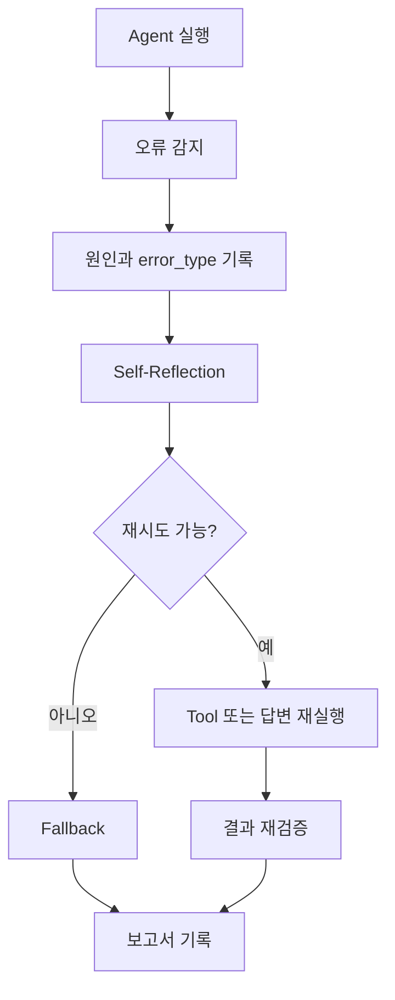

# 에이전트 시험 결과 보고서 샘플

> 이 파일은 작성 형식을 보여 주는 샘플입니다. 표의 빈칸을 팀 프로젝트의 실제 실행 결과와 측정값으로 채운 뒤 제출합니다.

## 1. 시험 목적

일정 조정 에이전트가 사용자의 요청을 올바르게 분석하고, 필요한 Tool을 선택하며, 오류 상황에서 재시도 또는 fallback을 수행하는지 검증합니다.

## 2. 오류 감지 기준

| 오류 유형 | 설명 | 감지 기준 |
| --- | --- | --- |
| 할루시네이션 | Tool 결과에 없는 시간을 응답함 | `tool_results`와 `final_answer` 비교 |
| Tool 선택 오류 | 필요한 Tool을 호출하지 않음 | `required_tools`와 `tools_called` 비교 |
| 파라미터 누락 | 참석자, 날짜, 회의 길이 누락 | State 필수 필드 검증 |
| 응답 불일치 | 불가능한 시간을 가능하다고 말함 | 후보 시간 목록과 최종 응답 비교 |
| 일정 충돌 | 가능한 시간이 없음 | `available_slots` 길이 확인 |

## 3. 재시도와 fallback 정책

| 오류 유형 | 재시도 횟수 | 전략 | 종료 기준 |
| --- | ---: | --- | --- |
| Tool 선택 오류 | 1 | Tool 정책을 전달하고 Agent가 다시 판단 | 올바른 Tool 호출 성공 |
| 파라미터 누락 | 0 | 추가 질문 생성 | `waiting_user` |
| Tool 실패 | 1 | 동일 Tool 재시도 | 2회 실패 시 fallback |
| 일정 충돌 | 0 | 대체 날짜 또는 시간 축소 제안 | 대체 제안 생성 |
| 응답 불일치 | 1 | Tool Result 기반으로 답변 재생성 | 일치하면 종료 |

## 4. 피드백 루프

## 5. 버전별 개선 이력

| 버전 | 변경 내용 | 개선 목표 | 실제 결과 |
| --- | --- | --- | --- |
| v1 | 기본 LLM Tool Calling | 정상 요청 처리 |  |
| v2 | State와 Tool Result 검증 추가 | 정보 부족과 근거 불일치 감지 |  |
| v3 | Self-Reflection과 재시도 추가 | Tool 선택 오류 감소 |  |
| v4 | fallback과 종료 조건 추가 | 무한 반복과 불명확한 실패 방지 |  |

## 6. 테스트 결과

| 시나리오 | 입력 | 기대 결과 | 실제 결과 | 통과 여부 |
| --- | --- | --- | --- | --- |
| 정상 일정 요청 | 민수, 지영과 내일 30분 회의 잡아줘 | 가능한 시간 제안 |  |  |
| 정보 부족 | 회의 잡아줘 | 추가 질문 후 `waiting_user` |  |  |
| 일정 충돌 | 모두 바쁜 시간 요청 | 존재하지 않는 시간을 만들지 않고 대안 제시 |  |  |
| Tool 오류 | 일정 조회 실패 상황 | 1회 재시도 후 fallback |  |  |
| 응답 불일치 | Tool Result와 다른 시간 생성 | Self-Reflection 후 수정 |  |  |

## 7. Self-Reflection 전후 비교

| 지표 | 적용 전 | 적용 후 | 측정 방법 |
| --- | ---: | ---: | --- |
| `task_completion_rate` |  |  | 완료된 테스트 / 전체 테스트 |
| `tool_selection_accuracy` |  |  | 올바른 Tool 선택 수 / 전체 Tool 선택 |
| `response_consistency_score` |  |  | Tool Result와 최종 응답 일치 수 / 전체 응답 |
| `average_retry_count` |  |  | 전체 재시도 횟수 / 테스트 수 |
| `fallback_rate` |  |  | fallback 종료 수 / 전체 테스트 |

## 8. 결론

이번 테스트에서 확인한 주요 문제:

- 

수정한 내용:

- 

추가 개선이 필요한 내용:

- 
